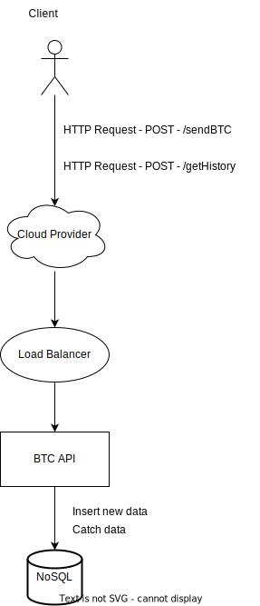
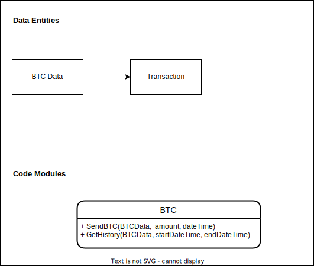

# Home Test - Back-end Engineer Golang

## BTC Billionaire
Let's imagine a lot of people send BTC to your wallet every `second` from `different
countries` from different `timezones'. The amount of BTC and the time represented by abstract
record looks like this:

At this time you’ve already collected `1000 BTC`. You want to show a history of your wallet balance at
the end of each `hour` between the DateTime range.
The data you want to provide contains an array of data that should look like:
```json
[
  {
    "datetime": "2019-10-05T13:00:00+00:00",
    "amount": 1000
  },
  {
    "datetime": "2019-10-05T14:00:00+00:00",
    "amount": 1001.1
  }
]
```
You decide to create a web server with API (any of these `GraphQL`/`REST`/`GRPC`) and use any
frameworks/technologies/libraries that will help you.
Your server should have 2 features:

1) Save Record
   Input example:
```json
{
"datetime": "2019-10-05T14:45:05+07:00",
"amount": 10
}
```
Output:
```
{
// Any output what can be recognized as successful
}
```

2) Get history of your wallet balance at the end of each `hour` between two DateTimes
   Input example:
```json
{
    "startDatetime": "2011-10-05T10:48:01+00:00",
    "endDatetime": "2011-10-05T18:48:02+00:00"
}
```
Output example:
```json
[
    {
        "datetime": "2019-10-05T13:00:00+00:00",
        "amount": 1000
    },
    {
        "datetime": "2019-10-05T14:00:00+00:00",
        "amount": 1001.1
    }
]
```
You’re on the road to becoming super rich and famous!!! More and more people will want to send you BTC
and check on your wealth history.
This means: your server should be ready to accept throughput with an acceptable timeout.
You also want to show your friends that you are an awesome BE developer.
This means that:

1. You can use Git
2. Your code is clear
3. You know best practice and patterns
4. Your API can handle incorrect data
5. Your architecture is extendable
6. Your API is tested


   Bonus points:
1. During the COVID-19 pandemic, you started to give out small amounts of BTC as donation. After a
   few hundred thousand records in and out, you decided to check your latest balance. The response
   time should be around the same as checking the latest balance after a few hundred records..
   
Create a repository and a set of instructions for your fellow BE dev friends on how to easily launch your
   server.

## Architecture Design
First, let's start by understanding the service requirements. We receive **several transactions per second**, we want to have **low latency**, and we have **data persistence**.
Let's consider that we will be using a cloud provider, so regarding the scalability of the application, it will be according to demand. So let's provide an application that is **easy to scale**. In addition, we need to **persist the data and have scalability**, as there is not much data manipulation and association, we can use a **NoSQL database**.



## API Design
I intend to design this API using Data Oriented Programming (DOP), therefore I am using Data Driven Design to
design this application.

**Data Entities:**





As you can see from the diagram above, the project requires low complexity in terms of data processing. Therefore, a high level of decoupling is not necessary, I will try to keep the project as simple as possible, with as few abstractions as possible.

## Project Structure
Currently, there are several models to better structure the project. I decided on **Package Oriented Design**, as it fits the idea of ​​Data Oriented Programming and brings greater usability and portability to the project.


## How to use?
### Build project
To run this project on your machine, you need to have **Docker installed**.

Inside this project root run the follow command:
```
docker-compose up --build
```

Wait until build process is finished and application start running.

### Usage
#### SendBTC Example
```
curl -X POST http://localhost:8080/sendBTC \
    -H 'Content-Type: application/json' \
    -d '[
    {
        "datetime": "2019-10-05T13:00:00+00:00",
        "amount": 1000
    },
    {
        "datetime": "2019-10-05T14:00:00+00:00",
        "amount": 1001.1
    }
]'
```
#### GetHistory Example
```
curl -X POST http://localhost:8080/getHistory \
-H 'Content-Type: application/json' \
-d '{
"startDatetime": "2019-10-05T13:00:00+00:00",
"endDatetime": "2020-10-05T13:00:00+00:00"
}'
```

## Final remarks:

Due to the purpose of the project, I decided not to use environment variables and implemented the tests only in the application's core package. In order to make it as simple as possible, and avoid any kind of errors or bugs.